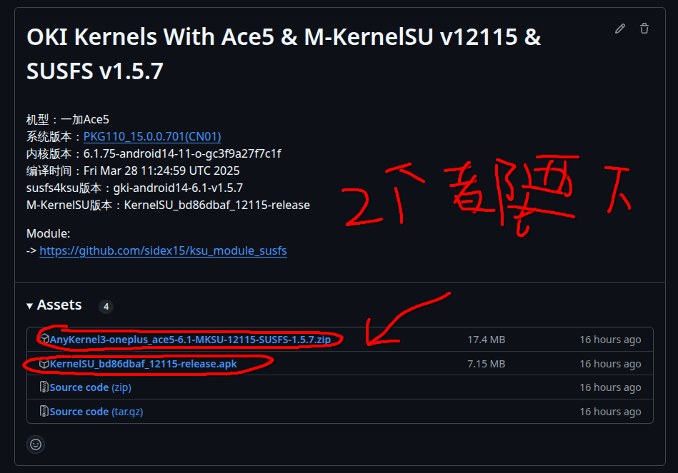
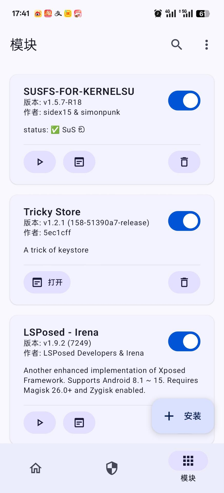

# 安装 {#title}

## 确认你的设备已获取root权限 {#check-root}

在正式开始之前请确认你的设备已获取root权限，如果没有，请[查看此教程](noroot-installation)先获取root权限

## 备份你的 boot.img {#backup-you-boot}

在进行刷机操作之前，你必须先备份好自己的原厂 boot.img。如果你后续刷机出现了任何问题，你都可以通过使用 fastboot 刷回原厂 boot 来恢复系统。

::: warning
任何刷机操作都是有风险的，请务必做好这一步再进行下一步操作！！必要时你还可以备份你手机的所有数据。
:::

## 必备知识 {#acknowage}

### ADB 和 fastboot {#adb-and-fastboot}

此教程默认你会使用 ADB 和 fastboot 工具，如果你没有了解过，建议使用搜索引擎先学习相关知识。

## 开始安装 {#start-install}

### 寻找版本并下载 {#search-version-dl}

前往[本项目的稳定构建](https://github.com/mcxiaochenn/Action_OKI_KernelSU_SUSFS/releases),找到适合你的机型并下载两个文件

### 下载AK3刷写工具 {#download-HorizonKernelFlasher}

下载[HorizonKernelFlasher](https://github.com/libxzr/HorizonKernelFlasher)工具（[下载直链](https://github.com/libxzr/HorizonKernelFlasher/releases/download/v1.3/app-release.apk)）并安装，然后在KernelSU(Alpha等)内给予其超级用户权限。

### 选择并刷入 {#set-fxxkboot}

打开HorizonKernelFlasher，自动弹出选择界面，选择你下载的AK3包（名称应为AnyKernel3-oneplus_xxx_x-x,x-MKSU-xxxxx-SUSFS-x.x.x.zip）

刷入完成弹出是否重启请选择“否”

::: tip
本篇教程中出现的“x”如无额外提醒则均代表任何字符。
:::

### 安装MKSU管理器 {#install-MKSU}

安装[寻找版本并下载](#search-version-dl)步骤中下载的MKSU管理器（名称应为KernelSU_xxxxxxxx_xxxxx-release.apk）

安装完成后你可能会发现为什么MKSU的名字依然为KernelSU，请放心，并不是你下载错文件了，而是[5ec1cff](https://github.com/5ec1cff/KernelSU)在编写此项目时没有修改软件名字，但修改了包名和签名，故不用担心与原版KSU出现冲突。

### 大功告成...了吗？ {#are-u-ok}

别急，在重启前请确保你此前的root方式为alpha、ksunext、apatchnext、mksu中的任意一项或确保管理器的模块挂载方式为Magic Mount或类似方法，而非overlayfs或img方式，否则你的手机可能就睡着了。
解决方式也很简单，打开你的mt管理器，前往/data/adb/删除此文件夹下的所有文件

::: tip
此处不推荐直接删除adb文件夹，部分机型直接删除adb文件夹会导致系统无法启动！！！
:::

### 真的...大功告成...了吗？ {#are-u-ok-right}

确定你没有[以上问题](#are-u-ok)就可以愉快重启你的手机了，不出意外开机后你的MKSU就会显示GKI运行中了。

当然此时还没结束，你还需要做最后一步，下载并刷入 [**SUSFS-FOR-KERNELSU**](https://github.com/sidex15/susfs4ksu-module) 模块后，再重启一次，当你看到管理器内此模块显示如下图界面，则代表大功告成！

**鸣谢：XiangYaoKaiXin**或**唐宋元清明** 提供的截图

### 大功告成！

那么恭喜你🎉，你已经成功刷入了带有SUSFS的基于一加官方源码编译的内核了，算是解决了KSU检测到Abnormal Environment这一最大痛点，好好享受玩机带来的乐趣吧！enjoy oneself！🎉

::: tip
本章部分文案来自[KernelSU文档](https://kernelsu.org/zh_CN/guide/installation.html)。
:::