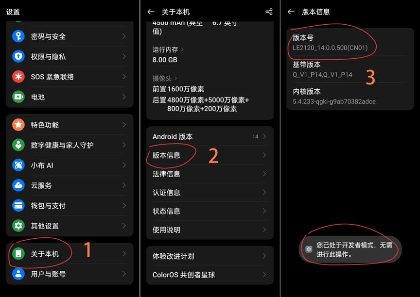
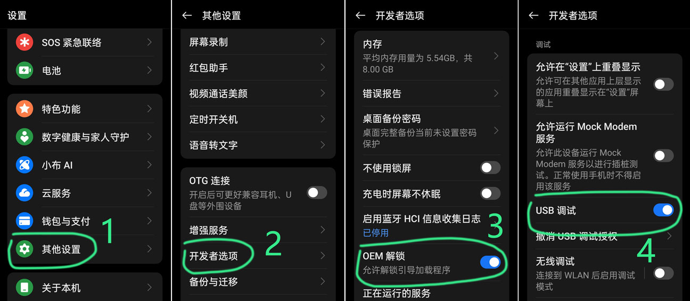
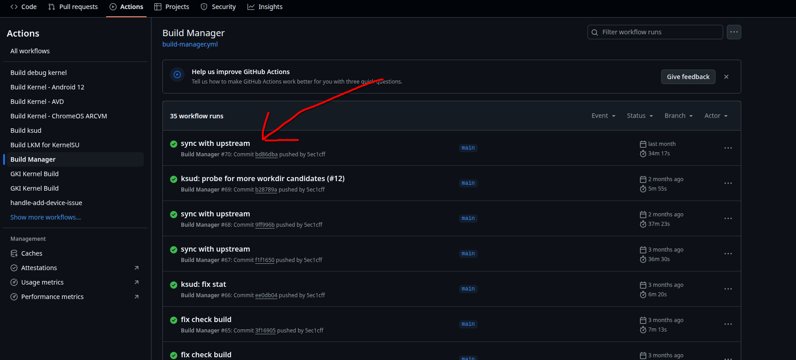
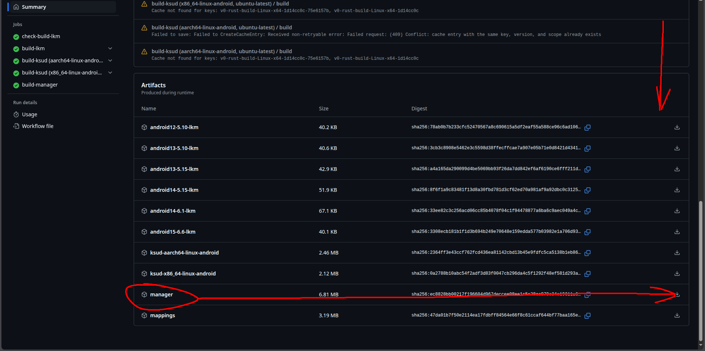
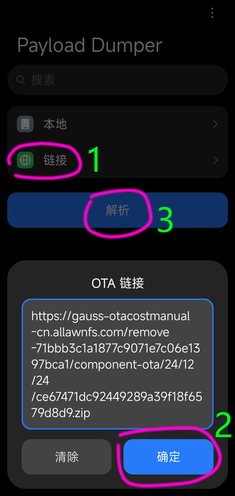
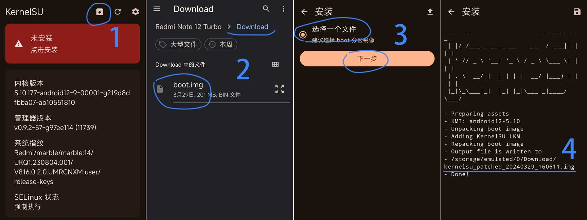
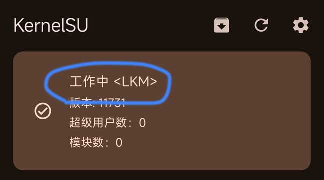

# 无root安装 {#noroot-installation}

::: warning
此教程为一加系设备定制，不一定具有通用型，请知晓！
:::

## 解锁Bootloader {#unlock-bootloader}

请确保你的手机已解锁bl，如果已经解锁可跳过此步骤。

::: warning
一加解锁Bootloader会导致数据清空，请注意备份！！！
:::

## 通过全能工具箱解锁（需要电脑） {#use-toolbox-unbl}

下载[大侠阿木](https://coolapk.com/u/%E5%A4%A7%E4%BE%A0%E9%98%BF%E6%9C%A8)的[一加全能工具箱](https://optool.daxiaamu.com/wiki_pctool)（[蓝奏云](https://daxiaamu.lanzn.com/b03xkgs9a)、[百度云](https://pan.baidu.com/s/1GtTjrsccONw0ORFNtI03yg?pwd=dxam) 提取码均为dxam）

打开后使用该工具的解锁bootloader功能，按照操作指引做即可

## 通过adb命令行解锁（可选电脑） {#use-platform-tools}

查找你身边一切有USB接口的可联网便携式设备，包括的不限于：安卓手机、win电脑、mac电脑、linux电脑、鸿蒙电脑、甚至树莓派nas都可以

### 下载 platform-tools 工具 {#dl-platform-tools}

::: code-group
```sh [win]
$ https://googledownloads.cn/android/repository/platform-tools-latest-windows.zip
```

```sh [mac]
$ https://googledownloads.cn/android/repository/platform-tools-latest-darwin.zip
```

```sh [linux]
$ https://googledownloads.cn/android/repository/platform-tools-latest-linux.zip
```

```sh [android]
$ 可使用甲壳虫ADB助手
```
:::

### 打开开发者选项 {#open-kfzxx}

设置 – 关于手机 – 版本信息 – 连击 版本号（开启 **开发者选项**）



### 开启OEM解锁和USB调试 {#open-oem-usb}

设置 – 其他设置（系统设置）- 开发者选项 – 开启 **OEM解锁**、**USB调试**



### 正式开始解锁 {#start-unlock-bl}

手机插入电脑，选择**传输文件**模式，解压[上面步骤](#dl-platform-tools)下载的**platform-tools**工具

在解压出来的文件夹中打开**CMD** or **终端**

输入下面的命令 进入**Bootloader**模式

```sh
adb reboot bootloader
```

进入**Bootloader**模式，再输入解锁命令

```sh
fastboot flashing unlock
```

:::warning
这是你最后的机会，如果你发现你还有重要资料没备份，那你现在后悔还来得及，请立刻长按电源键10秒重启回系统
:::

手机选择 **UNLOCK THE BOOTLOADER**

::: tip
音量键选择，电源键确定
:::


### 解锁完成！ {#unlock-bl-ok}

开机有黄字警告，就是解锁完成了（第一次开机会有点慢）

## 获取root权限 {#give-root}

时至今日，root管理器五花八门，有什么KernelSU、MKSU、SukiSU-Ultra、Alpha、Apatch等等等，受限篇幅，此处只讲[MKSU](#give-mksu-root)与[Alpha](#获取root权限-alpha篇)的安装方式

## 获取root权限（MKSU篇） {#give-mksu-root}

大致思路：下载管理器 -> 提取boot -> 修补boot -> fastboot刷入修补后的boot

### 下载MKSU管理器

因为MKSU管理器目前不发布稳定构建，需要去GitHub Actions下载，故需要一个GitHub账号，受限篇幅此处不多讲，继续观看本教程即默认你有且已登录GitHub。

[点此跳转](https://github.com/5ec1cff/KernelSU/actions/workflows/build-manager.yml)点击最新的一个成功构建选择**manager**下载





下载完成后解压并安装里面的安装包即可

### 提取boot分区镜像

首先根据机型不同，修补使用**boot**或**init_boot**并不是绝对的，推荐先打开管理器查看是推荐选择boot分区镜像还是init_boot分区镜像

### 提取boot分区镜像（免全量下载法）

目前有方法不用下载完整系统包即可提取镜像文件了

手机下载安装 [Payload-Dumper-Compose](https://github.com/rcmiku/Payload-Dumper-Compose/releases)

ROM 去 [Magisk中文网](https://magiskcn.com/roms.html) 找（[本站备份镜像](roms)），**注意**一定要和手机**系统版本一致**的系统包，**复制下载链接**

链接 – 粘贴**系统包下载链接** – 解析



解析成功可以看到所有分区，下载自己需要的 img 即可

文件管理**Download/Payload Dumper**可以看到提取的img

------------------------------------------

### 提取boot分区镜像（全量法）

ROM 去 [Magisk中文网](https://magiskcn.com/roms.html) 找（[本站备份镜像](roms)），**注意**一定要和手机**系统版本一致**的系统包，**复制下载链接**

下载完解压系统包只需要 **payload.bin** 文件

下载并解压解包工具[payload-dumper-go](https://mrzzoxo.lanzoue.com/b02plgdpi)

复制 **payload.bin** 文件进 **payload-dumper-go** 文件夹里面

复制 payload.bin 到 payload-dumper-go


打开 CMD 命令行


按照提示输入 b或i


打开 **img** 文件夹 可以看到提取的 **boot.img**/**init_boot.img**

### 修补内核镜像

打开MKSU

安装 – 选择 **boot.img** – 开始修补 – 修补完成

修补生成的文件 **kernelsu_patched-xxx.img** 在 **Download** 目录



### 刷入内核镜像

打开 [下载platform-tools工具](#dl-platform-tools)步骤中下载的工具

手机插电脑，打开**传输文件**模式，打开 **Download** 目录，把 **kernelsu_patched-xxx.img** 复制到电脑 **platform-tools工具** 文件夹中

手机进入 **Bootloader** 模式

```sh
adb reboot bootloader
```

手机进入bootloader模式后，输入下面的刷入命令

::: code-group
```sh [boot刷入命令]
fastboot flash boot kernelsu_patched-xxx.img
```
```sh [init_boot刷入命令]
fastboot flash init_boot kernelsu_patched-xxx.img
```
:::

::: tip
**kernelsu_patched-xxx.img**每次修补生成的名字都不一样，使用的时候请输入生成的名字
:::

显示 ***OKAY*** 就是成功刷入了。再使用下面的指令重启手机

```sh
fastboot reboot
```

显示 **工作中 LKM** 成功刷入 MKSU



### 至此MKSU安装成功

## 获取root权限（Alpha篇）
咕咕咕......